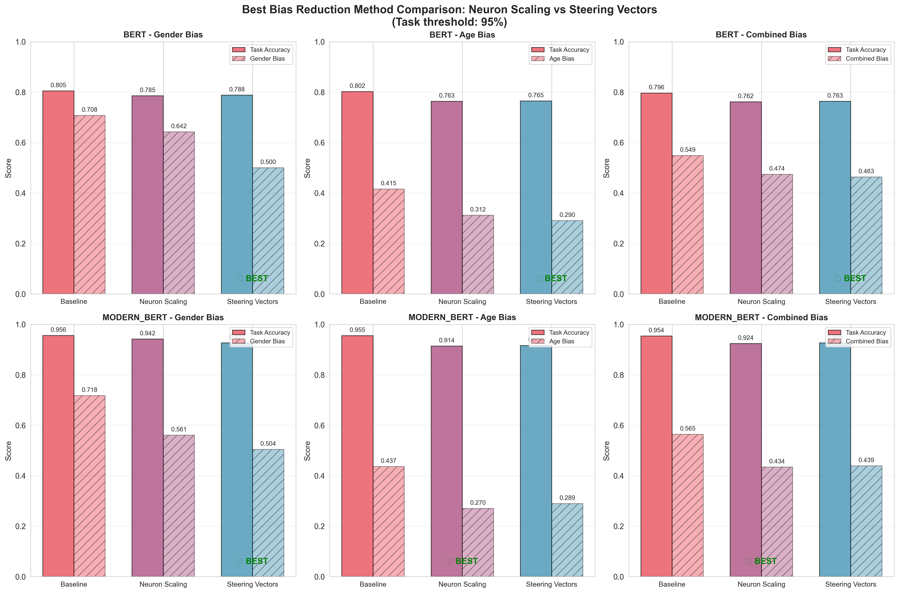
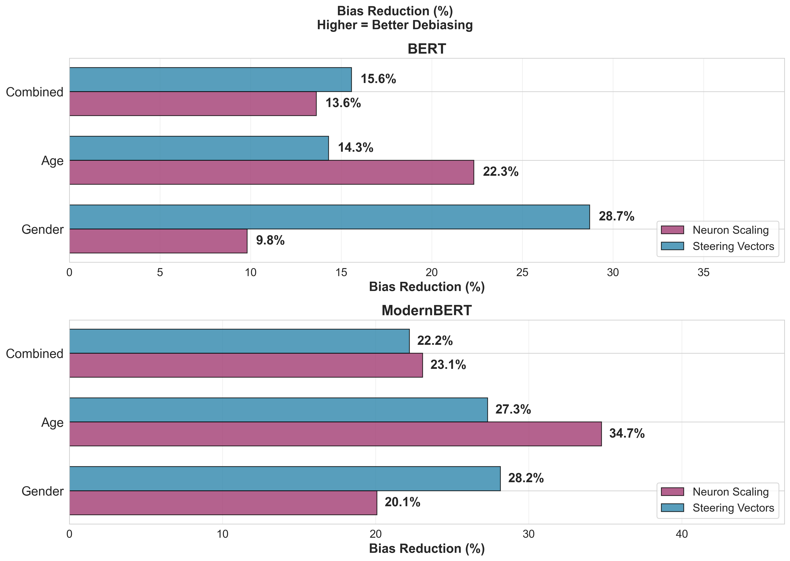
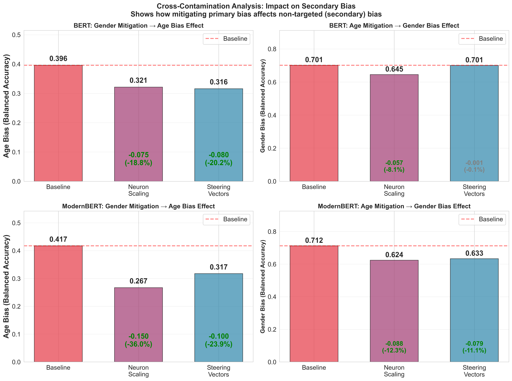

# Comparing Neuron Scaling and Steering Vectors for Gender and Age Bias Mitigation in Language Models

A comprehensive research project investigating bias mitigation techniques for BERT and ModernBERT language models in author profiling tasks, with focus on mitigating gender and age biases while maintaining task performance.

## 📋 Overview

This project explores two novel bias mitigation approaches:

1. **Neuron Scaling**: Identifying and scaling bias-encoding neurons through activation analysis
2. **Steering Vectors**: Using contrastive representations to steer model predictions away from biased outputs

We evaluate these methods on the PAN16 author profiling dataset, examining both single-attribute (gender OR age) and simultaneous multi-attribute bias mitigation.

## 🎯 Research Objectives

- **Primary Goal**: Reduce demographic bias in author profiling models without significant task performance degradation
- **Evaluation Criteria**: 
  - Maintain ≥95% of baseline task accuracy
  - Maximize bias reduction (measured by balanced accuracy on bias attributes)
  - Analyze cross-contamination effects (how mitigating one bias affects others)
- **Models**: BERT-base and ModernBERT-base
- **Bias Types**: Gender (binary) and Age (5 classes: 18-24, 25-34, 35-49, 50-64, 65+)

## 🏗️ Architecture

### Three-Head Model Design

We implement a frozen encoder architecture with three independent classification heads operating on the [CLS] token output from the frozen base model (BERT or ModernBERT):

- **Shared Intermediate Layer**: 256-dimensional layer with ReLU activation processes [CLS] output
- **Task Head**: Linear classifier predicting task labels (2 classes) - the primary task
- **Gender Bias Head**: Linear classifier predicting gender (2 classes) - bias attribute
- **Age Bias Head**: Linear classifier predicting age (5 classes) - bias attribute

All three heads share the same 256-dimensional intermediate representation and are trained jointly using a weighted loss function (task weight: 1.0, bias attribute weights: 0.5 each). The frozen encoder ensures that bias information remains encoded in the representations, making it accessible for subsequent identification and mitigation.

## 🔬 Methodology

### Phase 1: Neuron Identification
1. Train three-head model with frozen encoder
2. Extract layer-wise activations for all samples
3. Train linear probes to predict bias attributes from activations
4. Compute activation differences between demographic groups
5. Rank neurons by bias signal strength

### Phase 2: Bias Mitigation

#### Neuron Scaling
- **Zeroing**: Set top-k bias neurons to zero
- **Scaling**: Multiply neuron activations by factors (e.g. 0.1, 0.4, 0.8, 1.2, 1.6, 2.0)
- **Coverage**: Test 5%, 10%, 15%, 20% of neurons
- **Layer Strategies**: top_3, first_half, second_half, all_layers

#### Steering Vectors
- Compute mean activation differences between demographic groups
- Apply steering at inference: `activation += coefficient × steering_vector`
- **Coefficients**: 0.1 to 10.0
- **Layer Strategies**: Same as neuron scaling

### Phase 3: Evaluation

- Task accuracy preservation
- Bias reduction (via balanced accuracy on bias attributes)
- Cross-contamination analysis (secondary bias effects)
- Multi-seed validation (seeds: 42, 123, 1337)

## 📂 Project Structure

```
bias-mitigation/
├── code/
│   ├── 1_pan16_preprocess.py          # Data preprocessing
│   ├── 2_probe_training.py            # Train linear probes
│   ├── 3_activation_diff_gender.py    # Compute gender neuron maps
│   ├── 4_activation_diff_age.py       # Compute age neuron maps
│   ├── 10_combine_neuron_maps.py      # Merge gender+age maps
│   ├── 11_combined_labels_3_head_model.py  # Train 3-head model
│   ├── 12_combined_labels_bias_mitigation.py  # Neuron scaling (combined)
│   ├── 13_steering_vectors_combined.py      # Steering (combined)
│   ├── 14_steering_vectors_gender.py        # Steering (gender only)
│   ├── 15_steering_vectors_age.py           # Steering (age only)
│   ├── 16_methods_comparison_plots.py       # Generate visualizations
│   └── 17_best_approach_analysis.py         # Select optimal configs
├── data/
│   └── pan16_embeddings/             # Layer-wise activations
├── models/
│   └── three_head_combined/          # Trained models
├── results/
│   ├── activation_differences/       # Neuron rankings
│   ├── neuron_scaling_bias_mitigation_{gender,age,combined}/
│   ├── steering_vectors_{gender,age,combined}/
│   ├── best_approach_analysis/       # Optimal configurations
│   └── plots/                        # Visualizations
└── raw_data/
    └── pan16_raw/                    # Original PAN16 dataset
```

## 🚀 Running the Pipeline

### Prerequisites
```bash
pip install torch transformers numpy pandas scikit-learn matplotlib seaborn
```

### Execution Order

1. **Data Preparation**
   ```bash
   python code/1_pan16_preprocess.py
   ```

2. **Model Training**
   ```bash
   python code/11_combined_labels_3_head_model.py
   ```

3. **Neuron Identification**
   ```bash
   python code/2_probe_training.py
   python code/3_activation_diff_gender.py
   python code/4_activation_diff_age.py
   python code/10_combine_neuron_maps.py
   ```

4. **Bias Mitigation Experiments**
   ```bash
   python code/12_combined_labels_bias_mitigation.py
   python code/13_steering_vectors_combined.py
   python code/14_steering_vectors_gender.py
   python code/15_steering_vectors_age.py
   ```

5. **Analysis & Visualization**
   ```bash
   python code/17_best_approach_analysis.py
   python code/16_methods_comparison_plots.py
   ```

## 📊 Results

### Key Findings

Our experiments demonstrate effective bias mitigation with minimal task performance loss:

#### BERT-base Results

| Approach | Task Acc | Gender BA | Age BA | Primary Red. |
|----------|----------|-----------|--------|-------|
| **Baseline** | 79.65% | 70.15% | 39.60% | --- |
| Gender NS (2.0×, 20%, All) | 77.77% | 63.27% | 32.14% | -9.8% |
| **Gender Steering (10.0, Top3)** | **77.14%** | **50.00%** | **31.60%** | **-28.7%** |
| **Age NS (1.7×, 10%, All)** | **76.04%** | **64.49%** | **30.76%** | **-22.3%** |
| Age Steering (2.0, Top3) | 76.30% | 70.05% | 33.93% | -14.3% |
| Combined NS (1.9×, 15%, All) | 76.15% | 66.36% | 28.43% | -13.6% |
| **Combined Steering (7.0, 1st half)** | **76.35%** | **62.17%** | **30.49%** | **-15.6%** |

#### ModernBERT-base Results

| Approach | Task Acc | Gender BA | Age BA | Primary Red. |
|----------|----------|-----------|--------|-------|
| **Baseline** | 95.36% | 71.18% | 41.72% | --- |
| Gender NS (2.0×, 5%, Top3) | 93.30% | 56.88% | 26.72% | -20.1% |
| **Gender Steering (2.5, All)** | **92.22%** | **51.14%** | **31.75%** | **-28.2%** |
| **Age NS (2.0×, 5%, Top3)** | **92.07%** | **62.40%** | **27.23%** | **-34.7%** |
| Age Steering (2.5, 1st half) | 91.81% | 63.31% | 30.33% | -27.3% |
| **Combined NS (2.0×, 5%, Top3)** | **92.39%** | **59.75%** | **27.10%** | **-23.1%** |
| Combined Steering (4.0, 2nd half) | 92.65% | 54.69% | 33.15% | -22.2% |

**Legend**: BA = Balanced Accuracy, NS = Neuron Scaling, **Bold** = winner for each bias type

### Visual Analysis

Comprehensive visualizations available in `results/plots/method_comparison/`:

- **Pareto Fronts**: Task accuracy vs. bias trade-offs
- **Layer Strategy Comparisons**: Performance across different layer selections
- **Method Comparisons**: Neuron scaling vs. steering vectors
- **Cross-Contamination Analysis**: Secondary bias effects





### Key Insights

1. **Neuron Scaling Superior for Age**: Achieves 29-35% age bias reduction
2. **Steering Effective for Gender**: Up to 28.7% gender bias reduction (BERT)
3. **Cross-Contamination Benefits**: Single-attribute mitigation often reduces both biases
4. **Layer Strategy**: Top 3 layers most effective (closest to output)
5. **ModernBERT Robustness**: Better baseline and maintenance of task performance
6. **Task-Bias Trade-off**: ~3-4% task accuracy drop for substantial bias reduction

## 🔍 Technical Details

### Hyperparameters

- **Model Training**: AdamW optimizer, lr=2e-5, batch_size=32, epochs=3
- **Neuron Scaling Coverage**: 5%, 10%, 15%, 20%
- **Scaling Factors**: 0.0 (zeroing), 0.1, 0.4, 0.8, 1.2, 1.6, 2.0
- **Steering Coefficients**: 0.1, 0.2, 0.3, 0.5, 0.7, 1.0, 1.5, 2.0, 2.5, 3.0, 4.0, 5.0, 7.0, 10.0
- **Layer Strategies**: top_3 (last 3), first_half, second_half, all_layers

### Dataset Statistics

- **Training**: 436 authors
- **Validation**: 138 authors
- **Test**: 138 authors

## 📈 Reproducibility

All experiments run with three random seeds (42, 123, 1337) to ensure statistical robustness. Results reported are averages across seeds. Seed-specific results available in `results/*/seed_*/` directories.

## 🔗 References

- **Dataset**: PAN 2016 Author Profiling Task
- **Base Models**: 
  - BERT: `bert-base-uncased` (Devlin et al., 2019)
  - ModernBERT: `answerdotai/ModernBERT-base` (Portes et al., 2024)

<!-- ## 📝 Citation

If you use this work, please cite:

```bibtex
@misc{bias-mitigation-2026,
  title={Comparing Neuron Scaling and Steering Vectors for Gender and
Age Bias Mitigation in Language Models},
  author={[Your Name]},
  year={2026},
  publisher={GitHub},
  url={https://github.com/VladShev74/bias-mitigation}
}
``` -->

## 📄 License

This project is available under the GNU General Public License v3.0 (GPL-3.0).

## 👤 Author

**Vladyslav Shevchuk**

- GitHub: [@VladShev74](https://github.com/VladShev74)

---

*Research conducted at Johannes Kepler University Linz (JKU), 2026*